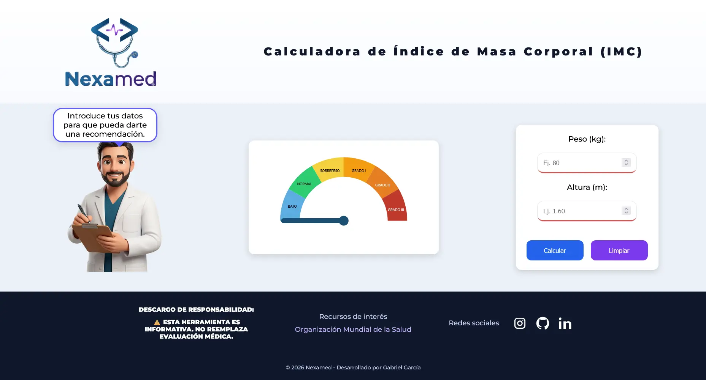

# Nexamed · Calculadora de IMC Interactiva 🩺

> Herramienta de educación en salud que combina lógica médica con una experiencia de usuario dinámica y accesible.

  

---

## ¿Qué es Nexamed?

Nexamed es una calculadora de Índice de Masa Corporal (IMC) diseñada con foco en la educación preventiva. Va más allá del simple cálculo numérico: ofrece visualización analógica, retroaloimentación personalizada y un asistente virtual que acompaña al usuario con consejos contextuales.

<a href="https://medgabrielgarcia-star.github.io/calculadora-imc/">Calculadora IMC</a>

---

## ✨ Características

| Funcionalidad              | Descripción                                                             |
| -------------------------- | ----------------------------------------------------------------------- |
| 📊 **Cálculo de IMC**      | Basado en peso (kg) y altura (m) con clasificación según estándares OMS |
| 🎯 **Indicador visual**    | Aguja animada en SVG que se posiciona según el rango del usuario        |
| 🤖 **Asistente virtual**   | Doctor interactivo con burbuja de diálogo                               |
| ⚖️ **Peso ideal**          | Cálculo automático del peso ideal y rango saludable según altura        |
| 🎉 **Feedback gamificado** | Confeti en rangos saludables y alertas visuales en casos de riesgo      |
| 📱 **Diseño responsive**   | Adaptado para móviles y escritorio                                      |

---

## 🛠️ Stack Tecnológico

- **HTML5** — Estructura semántica
- **CSS3** — Flexbox, animaciones `@keyframes` y variables CSS
- **JavaScript ES6+** — Lógica de cálculo, DOM y eventos
- **SVG** — Gráfico de aguja escalable
- **[canvas-confetti](https://github.com/catdad/canvas-confetti)** — Efectos de celebración

---

## 📋 Clasificación del IMC

Basada en los criterios de la Organización Mundial de la Salud (OMS):

| Clasificación         |  Rango IMC  |
| :-------------------- | :---------: |
| 🔵 Bajo Peso          |   < 18.5    |
| 🟢 Normal             | 18.5 — 24.9 |
| 🟡 Sobrepeso          | 25.0 — 29.9 |
| 🟠 Obesidad Grado I   | 30.0 — 34.9 |
| 🔴 Obesidad Grado II  | 35.0 — 39.9 |
| 🟣 Obesidad Grado III |   ≥ 40.0    |

> 💡 El peso ideal se calcula usando el punto medio del rango saludable (IMC = 22 kg/m²).

---

## 👤 Autor

**Gabriel García**
Médico General · Desarrollador en formación

---

## ⚕️ Descargo de responsabilidad

Esta herramienta es de carácter **informativo y educativo**. No reemplaza una evaluación médica profesional. Ante cualquier duda sobre tu estado de salud, consulta a tu médico.

---

  Hecho con 🩺 por Gabriel García · <a href="https://instagram.com/md_gabrielgarcia">@md_gabrielgarcia</a>

